**The Dybo App**

> The cash register of education

# Introduction

The cash register is a streamlined computer designed for efficiency within
a restricted context. The
Dybo, both software and hardware, wants to bring this kind of efficiency
to teachers and students to manage their job of teaching and learning.

The DyboApp is the main user application of the Dybo
device. It is through this app that teachers and students interact the
most. Its features are interconnected to maximize user comfort and to
save time. It anticipates the needs of the teacher or student
according to their
location and time of use, at home, school, in which class, and with
which collaborators.

The educational documents are based on hand annotated pdf documents
(with a stylus) and interactive presentation objects (DKM), which are 
plugged in when needed. These educational documents are organized in 
topics and binders. The plugged DKMs are
retrieved from existing libraries and/or user written in a script 
programming language.  The administrative contents are described in 
the *Business Objects* chapter. The educational contents 
are described in the *Knowledge Objects* chapter.

## Collaboration

The domain of development is vast, both in software and hardware
designs. To develop the project, we want to encourage european and world wide
collaborations with private initiatives, public institutions, educational
institutions, not limited to, in business, design, pedagogy, hardware,
management, software.

To do so needs a common understanding of the structure and design
of the Dybo software ecosystem.

# Business Objects

Business objects describe the objects involved in the user activities and their
relations. They are necessary to adapt to the activities the user
(learner or educator) needs to conduct.

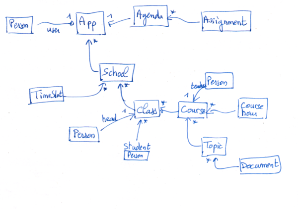

## Administrative Objects

These are the objects describing the educational management, not the
educational content; the administrative facets of the teacher and
student roles.

**App** (class `DyUserData`)
* user (Person)
* schools (1st school of the collection is the default one if required)
* agenda

In the Dybo host disk, the root of the unique App instance is given by
its message `#directory`. It returns the same directory entry as
`DyboSystem userDataPath`. This object and its attributes are saved in
the file *data.ob*, a serialization of a tree of saved objects.

**School** (class `DySchool`)

Description of the user's educational institutions. Possibly several
per user.

* name
* phone
* email 
* timeSlots
* classGroups

There is a default school establishment per user application, the 1st
one in the schools’ App collection attribute. Put together the courses
collection of the schools defines the schedule of the user (teacher or
student).

Each school instance has its own directory in the Dybo host disk, its
location is returned by the message `aSchool directory`. All these
school's directories are located in the App directory by default, or saved
at another location defined by the user.

**Time slot** (class `DyTimeSlot`)

Describe the organization of the teaching periods in a school. A
description per establishment is possible or for all of the user's
establishments when they share the same hourly organization. There are
generally 10 time slots (Geneva).

* name (of the period P1, P2, or H1, H2, etc.)
* startTime
* endTime

**Course hour** (class `DyCourseHour`)

Describes one or more contiguous teaching periods.

* room
* dayOfWweek
* timeSlots

**ClassGroup** (class `DyClassGroup`)

It describes a class: list of students and taught courses.

* number
* headTeacher(s) (person(s))
* students (persons)
* courses

Each class group instance has its own directory in the Dybo disk,
returned by the `#directory` message. Each class group directory is
located in its parent school directory.

**Course** (class `DyCourse`)

It describes a course of a teacher or a student.

* subject, the taught subject name (e.g. Mathematics)
* color, a distinctive attribute
* teacher,  a person, relevant for student user only
* courseHours, collection of DyCourseHour
* topics, a collection of topic objects taught in this course (e.g. Algebra, Geometry, Arithmetic, Analysis)

Each course instance has its own directory in the Dybo disk, returned
by the `#directory` message. Each course directory is located in its
parent class group directory.

**Person** (class `DyPerson`)

In the Person hierarchy:

* lastName
* firstName
* email

There are two types of people in this hierarchy, teacher and
student. Person instances can be sorted in a collection.

**Teacher** (class `DyTeacher`)

Described in the school instances

A kind of Personn, with an additional attribute

* courseSymbols: a collection of symbols to depict the type of DKM of
  interest for a teacher. A DKM has a dkmCourse property (pragma or
  attribute), a DKM is automatically load at application launch time
  when its dkmCourse is included in the teacher's courseSymbols
  collection.
  
Possible value of courseSymbols element: #music #mathematics #english
#physic #biology etc

**Student** (class `DyStudent`)

## Calendar

**Schedule**

*Not implemented yet.*

Informs about the schedule of the teacher or student. The schedule is
automatically established from the Courses data. It is therefore not a
set of data but an object capable of extracting this schedule
information. It provides an interface to respond to queries like "What
are the next periods of this course?"

**Agenda** (class `DyAgenda`)

The place to record teacher assignments (tasks) during a given school year. 
It is modeled by the user times slots (See DyTimeSlot).

* start (back-to-school day)
* end  (end-of-school day)
* daysOff (collection of DyDayInterval instances)
* tasks (homework, collection of Task instances)

**Task** (class `DyTask`)

Describe a task (homework) for a given course, the related course is 
automatically determined by the selected time slot and date.

* date
* timeSlot
* document

All tasks share the same directory returned by the message
`#directory`, located in the App directory.

## Organisational Objects

These objects describe where and how the educational documents are
organised.

**Binder**

A binder is a logical construction (it is computed) to present the
educational materials related to the user schools, class groups,
courses, topics and documents instances.

**Topic** (class `DyTopic`)

* title
* color
* documents
* resources 

Each topic instance has its own directory in the Dybo disk, returned
by the `#directory` message. Each topic directory is located in its
parent course directory. In this directory are located all the
documents data, each one in its own folder.

# Knowledge Objects

How can the educator represent, describe and modelise knowledge? How
can he/she share the represented knowledge with the learner? How can he/she
assess the learner's knowledge? How can the learner experiment and capture knowledge? How can she
share her understanding with others? How can he/she...

## Documents

The learning content of the Dybo is organized in interactive document
objects.

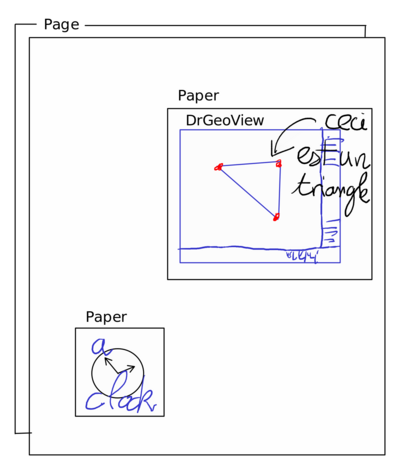

**Document** (classes `Document`, `DocumentModel`, `DocumentView`)

It is the root of a tree of visual contents. In a document, diversified contents
are inserted including DKMs described with script. 
The document is organized in disjoint pages.

A document instance informs about its folder with the message
`#dirName`. Its full path on disk depends on the context of its
creation; if created as a document of a task, it is appended to the
directory task, if created as a document in a topic, it is appended to
the topic directory.

**Page** (class `PageMorph`, `PageModel` hierarchy)

This view is a unit of a Document, this is the main place to
hand write. It is constituted of two layers :

* A page background model (`PageBackground`) and a paper (`PaperMorph`) with
extents identical to the page's extent it is attached to. Examples of
page backround are plain color, calculated (grid, writing lines, music
scope, etc), PDF model.

* The paper morph contains the user handwriting.

The user operates on a page with the document toolbar: pen, marker,
eraser, color and dedicated tools for handwriting operations.

Additionally, in a page, the user inserts composite objects (DKMs), 
kind of PlacedMorph (a Morph with a location), decorated with 
its own paper Morph, to retain contextualized and attached handwritten annotations. 
The decorator is an `AnnotatorMorph`, a special kind of Paper Morph
These composite objects can be moved in the x, y, z axis, rotated, scaled and
hand annoted.

**Paper** (class `PaperMorph`)

An object for handwriting. Each hand strokes between a pen down and a
pen up actions are recorded as strokes collected in a stroke group. The
paper morph contains all these stroke group morphs. Each group
contains individual stroke morphs, which are Bézier curves.

A special paper morph -- the `AnnotatorMorph` -- can decorate a target
view (interactive geometrz, simulation, time line, text editor, etc.) to attach user handwriting.

The annotator morphs are inserted in the paper of the page. It is paper in paper.

Below, samples of preliminary works on the paper morph handwriting:

Live demonstration https://mamot.fr/@drgeo/113340317300995188

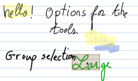
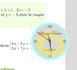

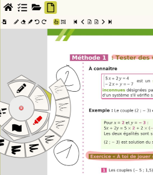

## Annotator
An annotator is a kind of paper morph decorating another morph -- the annotated object, therefore written notes can be attached to the annotator. When hovering or clicking on an annotator with the #pointerTool, a cloud of handles shows up, revealing possible actions depending on the annotated object. Possible handles:
* resize
* rotate
* z-layer +/-
* edit its Smalltalk script
* menu for additional actions

Example of a protractor decorated with written instructions. 

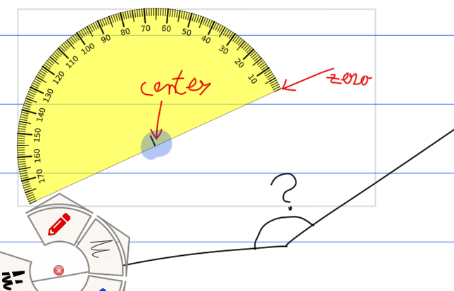

The annotated object can be a tool or a dynamic knowledge model. The distinction between a tool and a dynamic knowledge model is thin, nevertheless the two can be distinguished by the features of each one.

**Tools.**
* it offers affordances to manipulate it
* it may have side effects on the document as pen strokes
* it may be parameterized or described by a Smalltalk script 

Examples of tools: compass, ruler, protractor, calculator, chronograph, a picture, a soundtrack

Read more on [Tools](https://github.com/Dynamic-Book/doc/tree/main/4-Explanations/300-Tools)

**Dynamic knowledge model.**
* it designs knowledge
* it is described by an editable Smalltalk script with a dedicated DSL
* it has no side effect on the document itself
* it offers affordances to manipulate the model of the represented knowledge

Example of Dynamic knowledge models: geometry, algebra, cartography,
historic timeline, physic simulation, music score.

Read more on [Dynamic Knowledge Models](https://github.com/Dynamic-Book/doc/tree/main/4-Explanations/200-Dynamic-Knowledge-Models)

## Storage

The storage on disk is organized in directories, sub-directories and
objects. For fast prototyping, the objects are saved as
ReferenceStream and/or SmartReferenceStream. A more durable file
format may be decided later once the overall model stabilize
(Sqlite, XML, JSON, etc).

# GUI Layout

Describe the GUI layouts and flows between the different parts of the
DyboApp. In the next sections, Sketches and implementation views illustrate 
the layout.

## Home Page

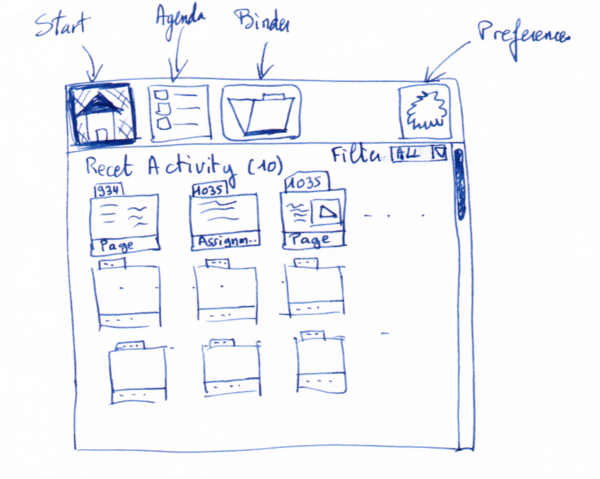

The **home page** always shows a list of recent activities. There are
the edited documents and the tasks. These items are sorted according
to the time of edition of the documents and the due date of the
tasks. Various **Filters** can be applied to narrow the list or to
sort differently.

A click on an item opens the document or the task page. The top bar
and its buttons Start, Agenda, Binder and Preferences are always
visible all along the workflow in the Dybo app.

## Task Page
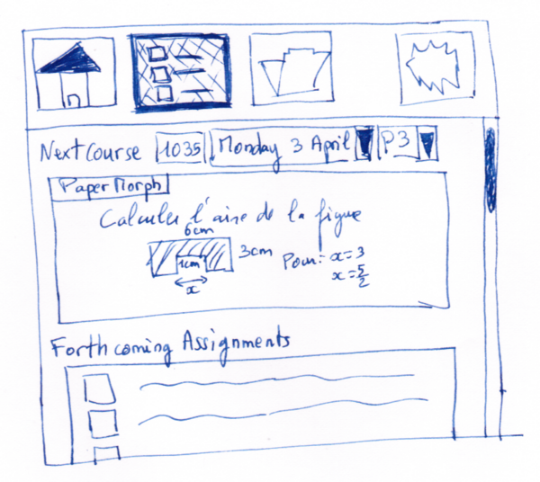
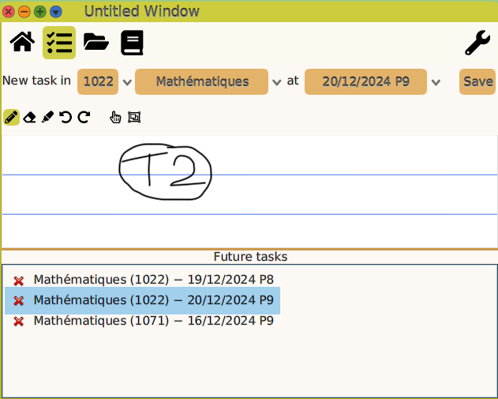

In the task page, the user quickly adds a task for the next
course. The Dybo tries to guess the class, the day and the period
according to the current date and time. If Dybo guessing is wrong,
it can be adjusted from the drop down lists.

The task can be handwritten, so the user can easily draw some
sketches.  On the bottom a list of the forthcoming tasks the user can
open for further details. A click on the Task button returns to the
previous task page.

## Smart Binder

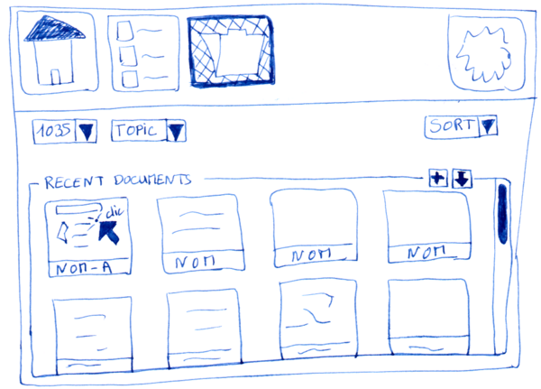
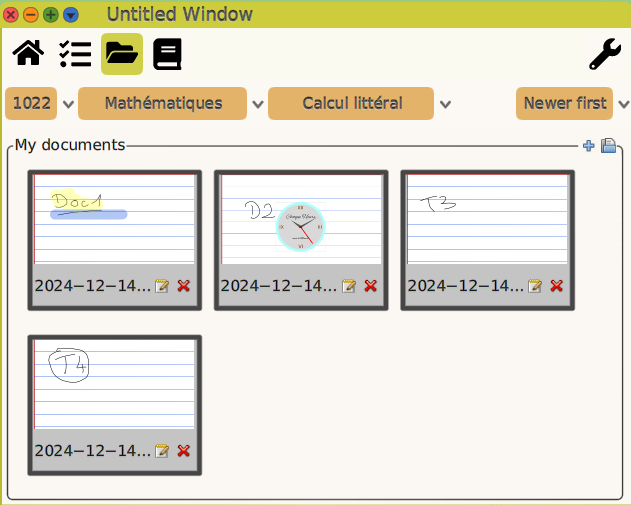

From the binder view, the user finds the class groups, then in each
one its related courses.  For each association of class group/course,
there is a binder object.

The course's binder content (documents) is organized in topics, freely
labeled. Examples of topics can represent groups of contents as
‘Theory’, ‘Exercises’, ‘Evaluation’ or taught topic as ‘Decimal
number’, ‘Triangle geometry’, ‘Pythagore’. Topics are a flat list of
label.

Regarding the organization in the OS, a class group (1035 in the
sketch) is a folder in the file system. A course is also a folder in
its parent class group folder.  Then, a topic is a folder in its
parent course folder. In a topic folder, each document is saved in 
a timestamped Document folder; in that folder the files doc.obj (a serialization 
of the document tree) and related ressources represent all the data 
of the document.

Therefore, the binder of a class group/course association is
represented as a collection of folders (class group, course, topics, 
Documents-xxx-xxx-xx) and files (documents).

For example, a valid path for a pedagogical document is:

`Flussschule/1035/Mathematik/Algebra/Dokument-2026-03-23-11h51m15s/`

The binder tries to guess the appropriate class group, courses and
 topic to present to the user. The guess is
 based on the current time of the day, the user schedule and the last
 edited documents. If the guess is not appropriate, the user can
 adjust the class group, course and topic from the dropdown lists.

In the *My documents/Recent Documents* frame, are presented mini views of the recent 
documents of the selected class group/course/topic. A click in one of these mini views opens
the document editor. From the quick buttons, at the right, the user can
create a new document or import a pdf document. In the hand sketch, the
courses drop down menu is not represented.

## Document Editor
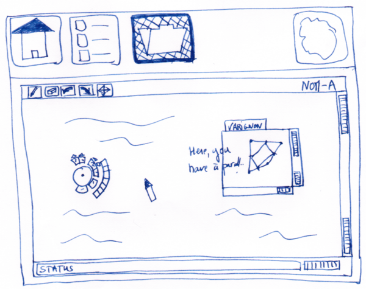
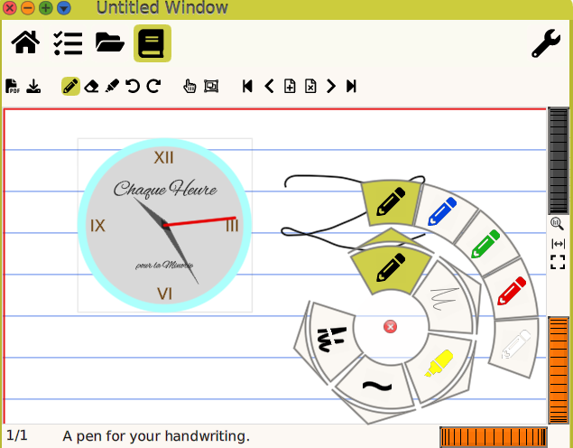

With the document editor, the user annotates imported PDF
documents. On the top of its view, a horizontal toolbar gives access
to the essential tools : pen, eraser, undo/redo operation and move
action. At the right and the bottom of the view, there are wheel
widgets to zoom in/out and to move in the ox and oy directions of the
document. At the bottom, a horizontal status bar gives information on
the current user tool and status.

Additional tools are invoked from the contextual circular toolbar and
its circular sub-toolbars.

## Preferences Editor
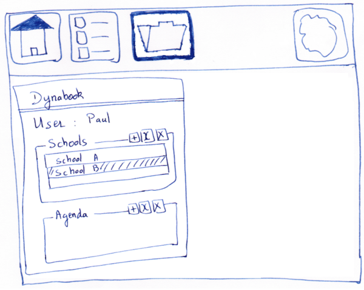
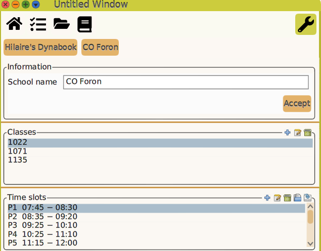

In the preference editor, the user browses in the administrative data
necessary to the application, to meaningfully present the information
to its user.

The user navigates the data with breadcrumbs starting with the top
level ‘Dybo’ object. From there she navigates the interdependent
objects presented in panels with editable fields for single instance
objects and decorated panels for collection of instances. The
educational documents associated with these objects are discarded by
the Preference editor.

Selecting the ‘Paul’ user presents his information, there is a ‘Save’
button to save editing of the three text fields. In the ‘Classes’
decorated panel, selecting ‘1035’, then the ‘edit’ quick button (the
second one) leads to the ‘1035’ object. Then the navigation can
continue to the ‘Mathematic’ course and so on.

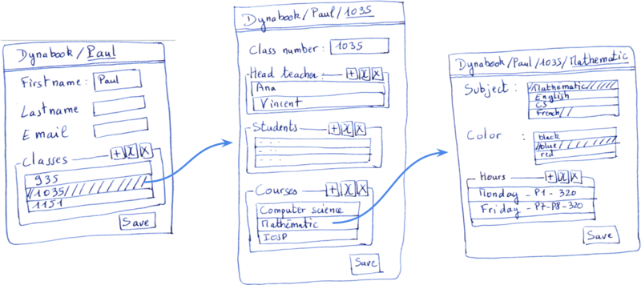

# UI Development

## Widgets

A set of custom widgets developped or to develop.

**DecoratedPluggableMorph**

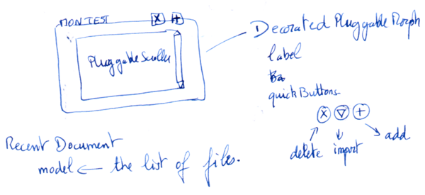
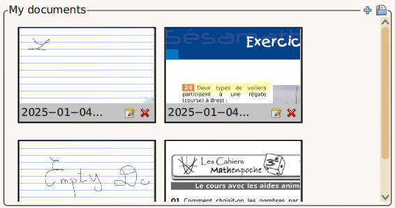

This widget, a sort of **decorated panel**, presents content
surrounded with a line, titled with a label and an optional collection
of quick action buttons.

It is a kind of PluggableMorph, therefore with a **model**. Its
additional attributes are **label** (a Text object) and
**quickButtons**, a collection of buttons. Should the button aspect be
defined in this class is still subject to consideration. Nevertheless
the height of the buttons should be normalized and fixed depending on
the label height.

The label informs the user about the presented contents, the quick
buttons perform actions on the model. Possible actions are creating
and importing content.

Examples of use cases are the ‘Recent Documents’, ‘Recent Activities’
and ‘Forthcoming Tasks’ views presented in the previous sketches.

Other use cases is to view and edit a collection of objects of the
same nature. For example editing the collection of time slots or
subjects in a School instance. The scroller shows a list of selectable
time slots and the quick buttons present the ‘add’, ‘edit’ and
‘delete’ operations on the collections and its items.

**PreviewMorph**

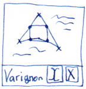
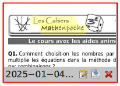

This morph presents the preview of a file on disk. The name of the
file is presented at its button with an optional collection of quick
action buttons.

It is a kind of ImageMorph, it comes with an **image** attribute
(instance of Form) and supplementary attributes **file** and
**selection**. It triggers the events **#selected** and
**#doubleClicked** when it is selected and double-clicked. Actions
related to the quick buttons are handled at the level of the object
instantiating the preview morphs.

**Breadcrumbs**

A widget with a main view in its bottom and top navigation bar. It is
used to browse the administrative objects, both for viewing and to
edition. Below, at the left a view of a school object, at the right
its edition.

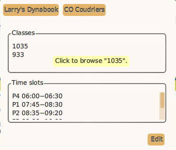
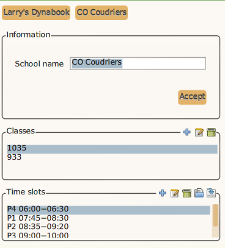

# Hardware

## Concept

# Annexes

## A1. Development schedule

A mere schedule to develop and to test iteratively. It is in
chronological order, however the points overlap.

* Develop the Dybo app
* Test Dybo app in school and iterate with the development (1 or 2
  users)
* Develop hardware prototype with existing hardware
* Develop Dybo operating system
* Test Dybo app in school and iterate with the development (tenth
  of users)
* Test Dybo in school and iterate on the hardware and software (1
  or 2 users)
* Test Dybo hardware and software with one classroom (30 users,
  students and teachers)

## A2. People to contact

* Caula, David (imppao), graphisme
* Goldberg, Adele (), Smalltalk author, educator
* Lup Yuen Lee, (@lupyuen@qoto.org), Pine phone hardware
* MNT Research, CEO (@mntmn@mastodon.social), open hardware laptop
* Oberson, Paul, SEM prospective
