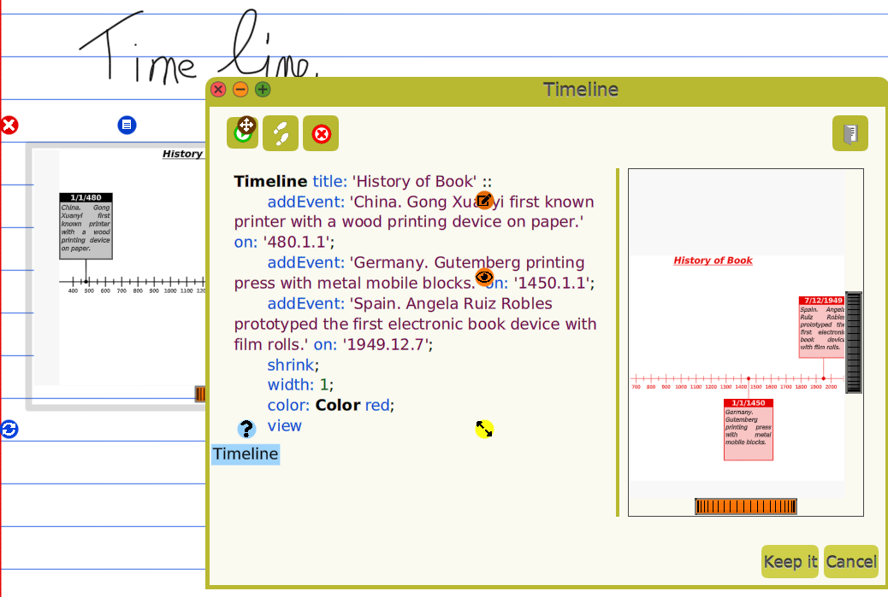

# Dynamic Knowledge Models

A Dynamic Knowledge Model (DKM) is a model representing a media of some knowledge you can interact with. Two basic examples of DKM are a digital image in very high resolution and a music score. The images are numerous in a paper textbook, however, contrary to digital image, you can't interact with to zoom-in to discover additional details.

A more elaborated example of a DKM, illustrating more precisely its model dimension, is a [DrGeo](http://gnu.org/s/dr-geo) geometric sketch. Described with a script, the user will insert it as an interactive view in her document, along handwritten notes. The user could then interact into this view, dragging objects to observe what is happening and discovering behavior to engage in new learning.

The model dimension in a given DKM is what makes it versatile, with one you can design a lot of different interactive contents. It relies on the facilities provided by Oriented Object Programming, as explained by [Adele Goldberg](https://youtu.be/IGNiH85PLVg?si=HpbUQNGj1SU6rfwj&t=860).
Technically, all these views are Morph instances representing a view of the underneath model. The Morphs offer a common way to interact and to integrate in the handwritten document.

# Examples

## Interactive geometry
In this example, the model itself is an interactive geometry engine from which the user produces sketches with simple text scripts, thanks to a dedicated [DSL](https://www.sciencedirect.com/topics/computer-science/domain-specific-language) --- ***Domain Specific Language***.

The user edits the model in the script editor at the left and gets the resulting dynamic media at the right, ready to be inserted in the document.

## Text editor
A text editor with style capabilities can be instantiated from a small
script. 

Watch the concept demonstrated:
https://mamot.fr/@drgeo/114154912013226195

## Timeline
Timeline is another neat example of DKM. We also illustrate here how
AI empowers the user, to both achieve what is wanted and also to
foster computer literacy, particularly in programming.

This timeline is computed from a dedicated and simple DSL. From the document, the dynamic timeline can be reedited at any time.

The DSL is so simple that an AI can learn to use it from an
example. Then when asking to create a timeline as "Give me another timeline for the the 10 most important battles of Alexander the great". It suggests:

``smalltalk
Timeline title: 'Major Battles of Alexander the Great' ::
	addEvent: 'Battle of the Granicus River. First major victory over Persian satraps in Asia Minor.' on: '-334.5.1'; 
	addEvent: 'Siege of Halicarnassus. The prolonged siege that forced the Persians to switch to naval warfare.' on: '-334.7.1'; 
	addEvent: 'Battle of Issus. Alexander directly defeats King Darius III, who flees the battlefield.' on: '-333.11.5';
	addEvent: 'Siege of Tyre. Seven-month siege using a massive mole (causeway) to conquer the island city.' on: '-332.1.1'; 
	addEvent: 'Siege of Gaza. A difficult, two-month siege of a key city on the route to Egypt.' on: '-332.10.1';
	addEvent: 'Battle of Gaugamela. The decisive, final defeat of Darius III and the Achaemenid Persian Empire.' on: '-331.10.1';
	addEvent: 'Battle of the Persian Gate. Alexander defeats a fierce resistance in the Zagros Mountains on the route to Persepolis.' on: '-330.1.1';
	addEvent: 'Siege of Aornos. Capture of a major mountain fortress, a feat even Hercules supposedly failed to achieve.' on: '-326.3.1';
	addEvent: 'Battle of the Hydaspes River. A costly victory over King Porus, featuring war elephants.' on: '-326.5.1';
	addEvent: 'Siege of Mallia. Alexander is severely wounded in a siege against the Malli tribe during his march south.' on: '-326.11.1';
	unshrink ;
	width: 4;
	color: Color gold;
	view
``

In only got wrong ``Color gold``, gold is not a color in Cuis-Smalltalk.

The resulting timeline:

 or a several lines Smalltalk script using the dedicated DSL of the model (e.g. DrGeo Smalltalk script). This is this view instance dragged and dropped in the page of document.

* From the page the model instance was dropped, it is possible to edit the script used to create the instance to redefine it: literally replacing the existing model instance by a new instance from the edited script.

* **The dynamic view can be annotated! Here a text editor with pen and
  highlighter annotations. The annotations are attached to the view,
  and move and rotate with it. When the document is scaled, the
  annotations scale accordingly**. The concept is to give the freedom
  to the user to write notes.

* The edited instance by script can be used as model for later use by dragging and dropping back it in a Flap.

* It has an icon and a textual description

* It can be load/saved from disk, from an archive

It contains a model, icon; one or several scripts, each one represented as a FlapItem in a Flap.
