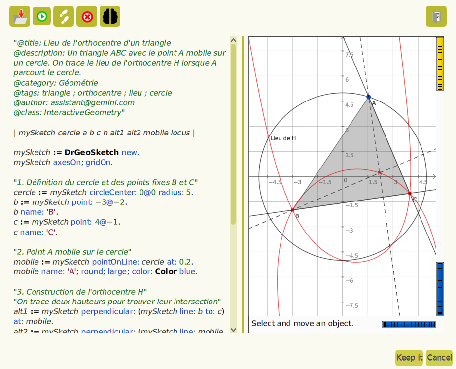
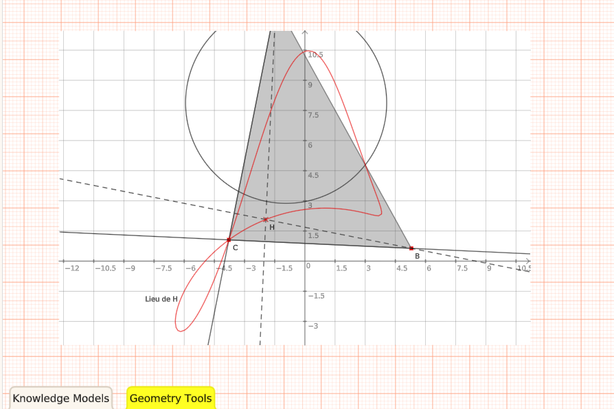
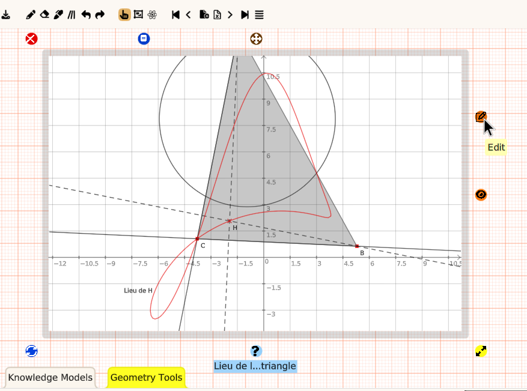
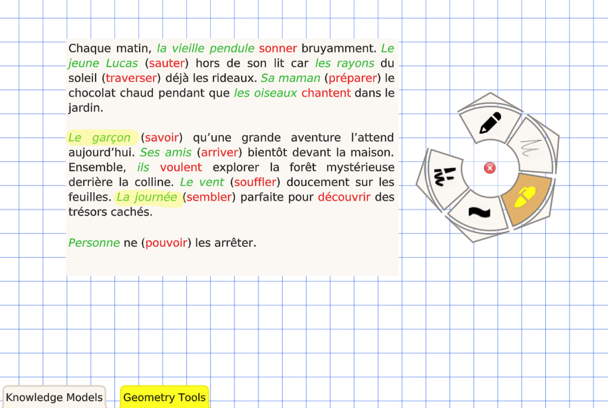
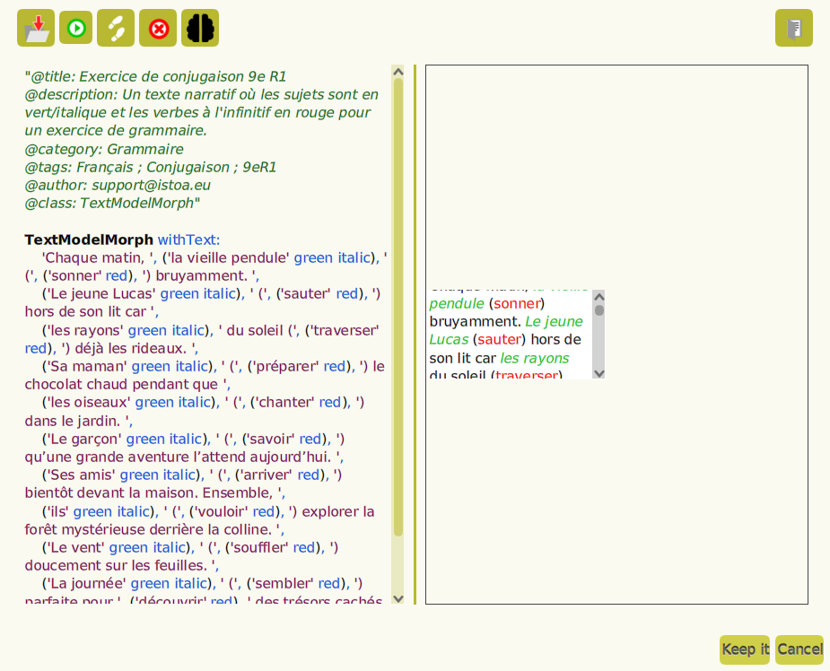
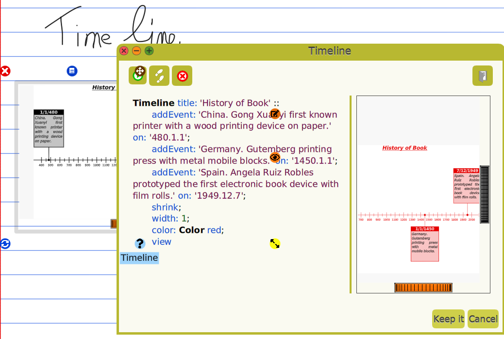

# Dynamic Knowledge Models

A Dynamic Knowledge Model (DKM) is a model representing a medium of
knowledge that you can interact with. A basic example of a DKM is a
digital image in very high resolution. While images are numerous in a
paper textbook, your interaction with them is limited: you can't
really zoom in to discover additional details—you might use a
magnifier, but it remains limited. On the contrary, with a digital image, you
can zoom in and discover additional details.

A more elaborate example of a DKM, illustrating its
model dimension more precisely, is a [DrGeo](http://gnu.org/s/dr-geo) geometric
sketch. Described with a script, the user will insert it as an
interactive view in their document, alongside handwritten notes. The user
can then interact with the view, dragging objects to observe what is
happening and discovering behaviors to engage in new learning.

The model dimension in a given DKM is what makes it versatile; with
it, you can design a lot of different interactive content. It relies
on the facilities provided by Object-Oriented Programming, as
explained by [Adele
Goldberg](https://youtu.be/IGNiH85PLVg?si=HpbUQNGj1SU6rfwj&t=860).
Technically, all these views are [Cuis](http://cuis.st)' Morph
instances representing a view of the underlying model. A Morph offers a
common way to interact with it and to integrate it into an end-user document.

# Examples

## Interactive geometry
In this example, the model itself is an interactive geometry engine from which the user produces sketches with simple text scripts, thanks to a dedicated [DSL](https://www.sciencedirect.com/topics/computer-science/domain-specific-language) --- ***Domain-Specific Language***.

The user edits the model in the script editor on the left and gets the resulting dynamic media on the right, ready to be inserted into the document.



Once edited and validated, the DKM view is updated in the user's
document. The user can then interact with this view. Below is an
interactive geometry sketch where the user drags objects and
observes the behavior of the whole sketch:



At any time, the user is free to edit a DKM script again to adjust
its content. With the pointer tool selected, hovering over a border of a
DKM view makes its halo icons emerge; the right edit button opens
the DKM script editor:




Scripts and sketches can be complex. Here is a randomized variation of the
Sierpinski square:


## Text editor

A text editor model with style capabilities proved to be a valuable
DKM. At first, it seems odd to have a text editor model as a DKM, but
scripting text and style turned out to be valuable.

An example of a French text turned into a conjugation exercise, with
styled subjects and verbs:



The example above also illustrates how a DKM view can be hand-annotated with the highlighter or the pen.

Again, this text exercise is described by a script, using the specific
Text Editor DKM's DSL:



Editing such scripts can be tedious, but AI has proven to be a valuable
aid. Indeed, an AI with appropriate training can write such scripts; in
fact, the example above was written by an AI with appropriate
instructions. The `brain` button in the DKM script editor generates
the specific prompt for a DKM.

## Timeline

The timeline is another neat example of a DKM, interestingly empowered
by AI to both retrieve historical events and edit the associated
script. Again, a timeline is described with a dedicated and simple DSL.



The DSL is so simple that an AI can learn to use it from an example or
an appropriate prompt. With the request: "Give me another timeline for
the 10 most important battles of Alexander the Great", it suggests the
script:

```smalltalk
Timeline title: 'Major Battles of Alexander the Great' ::
	addEvent: 'Battle of the Granicus River. First major victory over Persian satraps in Asia Minor.' on: '-334.5.1'; 
	addEvent: 'Siege of Halicarnassus. The prolonged siege that forced the Persians to switch to naval warfare.' on: '-334.7.1'; 
	addEvent: 'Battle of Issus. Alexander directly defeats King Darius III, who flees the battlefield.' on: '-333.11.5';
	addEvent: 'Siege of Tyre. Seven-month siege using a massive mole (causeway) to conquer the island city.' on: '-332.1.1'; 
	addEvent: 'Siege of Gaza. A difficult, two-month siege of a key city on the route to Egypt.' on: '-332.10.1';
	addEvent: 'Battle of Gaugamela. The decisive, final defeat of Darius III and the Achaemenid Persian Empire.' on: '-331.10.1';
	addEvent: 'Battle of the Persian Gate. Alexander defeats a fierce resistance in the Zagros Mountains on the route to Persepolis.' on: '-330.1.1';
	addEvent: 'Siege of Aornos. Capture of a major mountain fortress, a feat even Hercules supposedly failed to achieve.' on: '-326.3.1';
	addEvent: 'Battle of the Hydaspes River. A costly victory over King Porus, featuring war elephants.' on: '-326.5.1';
	addEvent: 'Siege of Mallia. Alexander is severely wounded in a siege against the Malli tribe during his march south.' on: '-326.11.1';
	unshrink ;
	width: 4;
	color: Color yellow;
	view
```
The resulting timeline:

The user can learn simple programming assisted by an AI. Of course,
the suggested historical data should be double-checked and the script
edited accordingly.

# Technical characteristics

A DKM has several characteristics and meets some requirements:

* It's a set of classes describing a model and at least one kind of
  PlacedMorph to represent its view. This view is plugged into the
  end-user document.

* A specific instance of a DKM is described by a script. The script
  can be as short as one line of code (i.e., VerbTableMorph newOn: 'remplir') or several lines long. A script is written in Smalltalk
  with the dedicated DKM's DSL (e.g., see examples above).

* A DKM instance inserted into a document can be edited at any time; its
  view is then modified accordingly. This is done by invoking
  the DKM script editor.

* A DKM view can be annotated! Here, a text editor DKM was
  annotated with a pen and a highlighter. The handwritten annotations
  are attached to the view, moving and rotating with it. When the
  document is scaled, the annotations scale accordingly.

* A DKM instance can be saved in the user's DKM library for later
  reuse.

* Each DKM model comes with an icon, a textual description, an
  example, and a text prompt for AI training.

* DKM instances can be loaded from and saved to the user library. They
  can be shared among users as simple text scripts.

The Cuis-Smalltalk package DKM-Core is the minimal prerequisite to
develop additional DKMs:
https://github.com/istoa-eu/app/tree/main/src/dkm

To experiment with the developed DKMs, try out the [iStoa simulation
environment](http://www.istoa.eu).