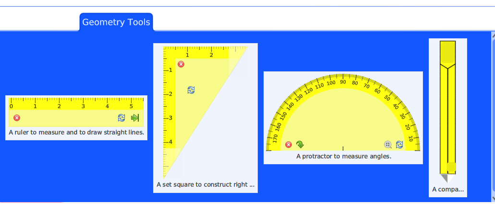

# Tools

The document GUI, beside the basic tools as pencil, highlighter, eraser, also provides specialized tools for geometric constructions.

## Straight line tools

These tools let you construct easily straight lines of all sort. They
can be resized or scaled to ease reading. When drawing a straight
lines, the user is not limited to the extent of the tool, the drawing
continues over the boundaries of the tool, in the same direction.

The protractor comes with a neat magnet feature. When constructing an
angle, the user benefits of a one degree accuracy.

The tools in action: [demonstration in video](https://mamot.fr/@drgeo/115198697315317043)

## Compass

With the compass tool, the user finds the handles to mimic a real
compass.  It is both a tool to construct arc and circle but also a
tool to learn how to use a real one.

The compass in action: [demonstration in video](https://mamot.fr/@drgeo/115255434292314969)
